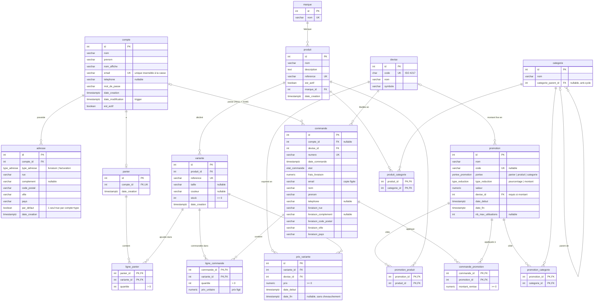

```mermaid
erDiagram
    compte ||--o{ adresse : "possède"
    compte ||--o| panier : "a"
    compte |o--o{ commande : "passe (NULL = invité)"
    panier ||--o{ ligne_panier : contient
    variante ||--o{ ligne_panier : "ajoutée dans"
    variante ||--o{ ligne_commande : "commandée dans"
    commande ||--o{ ligne_commande : contient
    commande ||--o{ commande_promotion : "applique"
    promotion ||--o{ commande_promotion : "appliquée à"
    devise ||--o{ commande : "libellée en"
    devise ||--o{ prix_variante : "exprimé en"
    devise |o--o{ promotion : "montant fixe en"
    marque ||--o{ produit : fabrique
    produit ||--o{ variante : décliné
    variante ||--o{ prix_variante : "a un prix"
    produit ||--o{ produit_categorie : ""
    categorie ||--o{ produit_categorie : ""
    categorie |o--o{ categorie : "parent de"
    promotion ||--o{ promotion_produit : cible
    produit ||--o{ promotion_produit : ""
    promotion ||--o{ promotion_categorie : cible
    categorie ||--o{ promotion_categorie : ""

    compte {
        int id PK
        varchar nom
        varchar prenom
        varchar nom_affiche
        varchar email UK "unique insensible à la casse"
        varchar telephone "nullable"
        varchar mot_de_passe
        timestamptz date_creation
        timestamptz date_modification "trigger"
        boolean est_actif
    }
    adresse {
        int id PK
        int compte_id FK
        type_adresse type_adresse "livraison | facturation"
        varchar rue
        varchar complement "nullable"
        varchar code_postal
        varchar ville
        varchar pays
        boolean par_defaut "1 seul true par compte+type"
        timestamptz date_creation
    }
    marque {
        int id PK
        varchar nom UK
    }
    categorie {
        int id PK
        varchar nom
        int categorie_parent_id FK "nullable, anti-cycle"
    }
    produit {
        int id PK
        varchar nom
        text description
        varchar reference UK
        boolean est_actif
        int marque_id FK
        timestamptz date_creation
    }
    produit_categorie {
        int produit_id PK, FK
        int categorie_id PK, FK
    }
    variante {
        int id PK
        int produit_id FK
        varchar reference UK
        varchar taille "nullable"
        varchar couleur "nullable"
        int stock ">= 0"
        timestamptz date_creation
    }
    devise {
        int id PK
        char code UK "ISO 4217"
        varchar nom
        varchar symbole
    }
    prix_variante {
        int id PK
        int variante_id FK
        int devise_id FK
        numeric prix ">= 0"
        timestamptz date_debut
        timestamptz date_fin "nullable, sans chevauchement"
    }
    panier {
        int id PK
        int compte_id FK, UK
        timestamptz date_creation
    }
    ligne_panier {
        int panier_id PK, FK
        int variante_id PK, FK
        int quantite "> 0"
    }
    commande {
        int id PK
        int compte_id FK "nullable"
        int devise_id FK
        varchar numero UK
        timestamptz date_commande
        etat_commande etat
        numeric frais_livraison
        varchar email "copie figée"
        varchar nom
        varchar prenom
        varchar telephone "nullable"
        varchar livraison_rue
        varchar livraison_complement "nullable"
        varchar livraison_code_postal
        varchar livraison_ville
        varchar livraison_pays
    }
    ligne_commande {
        int commande_id PK, FK
        int variante_id PK, FK
        int quantite "> 0"
        numeric prix_unitaire "prix figé"
    }
    promotion {
        int id PK
        varchar nom
        varchar code UK "nullable"
        portee_promotion portee "panier | produit | categorie"
        type_reduction type_reduction "pourcentage | montant"
        numeric valeur
        int devise_id FK "requis si montant"
        timestamptz date_debut
        timestamptz date_fin
        int nb_max_utilisations "nullable"
    }
    promotion_produit {
        int promotion_id PK, FK
        int produit_id PK, FK
    }
    promotion_categorie {
        int promotion_id PK, FK
        int categorie_id PK, FK
    }
    commande_promotion {
        int commande_id PK, FK
        int promotion_id PK, FK
        numeric montant_remise ">= 0"
    }
```